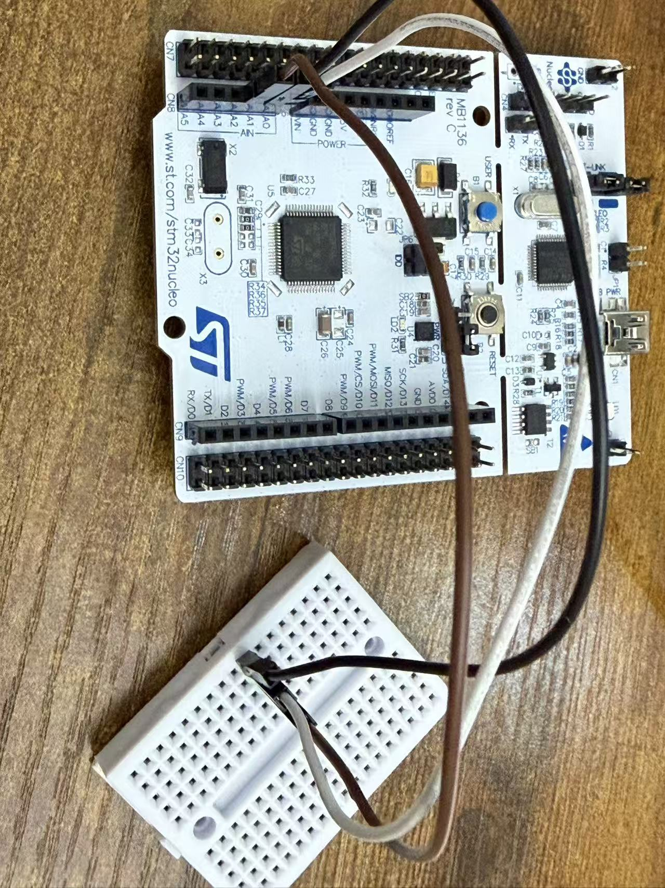
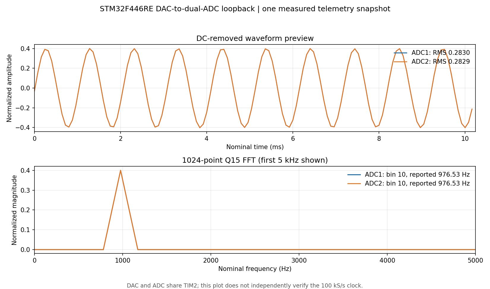

# FreeRTOS Dual-Channel Real-Time Spectrum Analyzer

[](https://github.com/Shanshan3133/stm32-freertos-spectrum-analyzer/actions/workflows/ci.yml)

Portfolio firmware for the STM32F446RE. The design configures two analog channels
for simultaneous 100 kS/s sampling, processes 1024-sample blocks, and emits
RMS, peak, dominant-frequency, waveform-preview, and spectrum data at 20 Hz.

The minimum hardware is one NUCLEO-F446RE, its Mini-USB data cable, a small
breadboard, and three male-to-male jumper wires. The STM32 DAC generates a
coherent 976.5625 Hz self-test tone; connecting PA4/A2, PA0/A0 and PA1/A1 to
one connected five-hole breadboard strip closes the DAC-to-ADC loop.
No sensor module, soldering, external programmer, or USB-to-UART adapter is
required. A logic analyzer is useful evidence but is not required to run it.

## Honest completion status

| Status | Scope |
|---|---|
| Host verified | CRC-16, framing, recovery, bounded spectrum reassembly, complete CSV export, bandwidth bound, and 21 Python/fault-injection tests; portable FFT/C tests pass Cortex-M4 strict compile checks and execute in Linux CI |
| Built and flashed on NUCLEO-F446RE | Reproducible ARM-GCC target build with official STM32CubeF4 HAL, FreeRTOS and CMSIS-DSP; dual-ADC/DAC DMA pipeline, USART2 DMA, task health voting, IWDG policy and WFI idle |
| Initial board smoke test | With ADC inputs floating, a 60 s ST-LINK virtual COM run produced 1194 channel-0 and 1193 channel-1 complete spectra, zero CRC/format/sequence errors and zero reported dropped blocks |
| DAC-to-dual-ADC loopback verified | With A2, A0 and A1 joined on one breadboard strip, a 1,800.071 s run delivered 35,998/35,999 spectra at 19.998/19.999 Hz; every frame peaked at bin 10, with zero CRC/format/sequence errors, reported drops, or 9 ms deadline misses |
| Processing time observed on board | Maximum 1,742 us and p99.9 1,731 us during the 30-minute run, from the firmware's DWT-derived telemetry field; these are observed values, not a proven WCET bound |
| Watchdog recovery observed | A dedicated DSP-stall firmware build caused repeated IWDG resets and reported `STATUS_WATCHDOG_RESET`; the normal firmware was restored and rechecked |
| Injected signal fault observed | A separate ADC-freeze build reported weak/frozen/injected status and cleared `SIGNAL_VALID` in 205 frames; normal firmware was restored and rechecked |
| Still requires separate measurements | Independently measured ADC trigger frequency and GPIO timing, task stack headroom, physical disconnect/clipping behavior, and exact watchdog recovery latency |

The loopback uses the same TIM2 trigger for DAC and ADC, so a peak at nominal
976.5625 Hz does not independently prove absolute clock/sample-rate accuracy.
The 30-minute maximum DSP time is not a WCET bound. The host/board timestamp
comparison estimated 99,995.19 samples/s, but this is not an independent
oscilloscope measurement. See the
[no-wire evidence](evidence/run-20260927/metadata.md),
[initial loopback evidence](evidence/run-20260928/metadata.md),
[30-minute and fault-injection evidence](evidence/run-20260928/additional-validation.md),
[raw endurance output](evidence/run-20260928/endurance-terminal.txt), and
[hardware acceptance checklist](docs/validation.md) for details.

## On-board evidence



The photograph shows the physical prototype used for the loopback validation.
The plot below is a separate live telemetry snapshot captured after the
30-minute run, not a simulated signal or a graph of the full endurance run.



The snapshot's [full 512-bin spectrum](evidence/run-20260928/spectrum-snapshot.csv),
[waveform preview](evidence/run-20260928/waveform-snapshot.csv), and
[capture metadata](evidence/run-20260928/snapshot-metadata.json) are available
for inspection. Plot axes use the configured nominal sample rate because DAC
and ADC share the trigger timer.

## Architecture

- ADC1 and ADC2 use dual regular simultaneous mode, triggered by TIM2 at
  100 kHz. DMA stores packed 12-bit samples in a two-half circular buffer.
- The acquisition task is released by DMA half/full-complete notifications and
  checks timestamp/generation continuity. The DSP task rejects a descriptor if
  DMA begins reusing its half-buffer before the samples are copied.
- The DSP task applies a Hann window and 1024-point FFT independently to both
  channels, calculates RMS/peak/dominant frequency, and overwrites a one-entry
  latest-result queue.
- The telemetry task compresses Q15 magnitudes to 8-bit values and sends eight
  bounded packets per result using USART2 TX DMA through the board's ST-LINK
  virtual COM port at 921600 baud.
- TIM5 runs as a 1 MHz 32-bit timebase, avoiding the approximately 23.9-second
  wrap that a raw 180 MHz DWT counter would have caused.
- The watchdog task feeds IWDG only after acquisition, DSP, and telemetry have
  all reported real data-path progress within the voting window. Queue or DMA
  timeouts deliberately withhold a vote instead of disguising a stalled pipeline.
- Idle uses `WFI`; deeper STOP-mode claims are deliberately outside this
  continuous 100 kS/s instrument.

See [architecture](docs/architecture.md), [protocol](docs/protocol.md), and the
[timing budget](docs/timing_budget.md).

The processing order is deliberately fixed:

```text
unpack ADC -> calculate/remove each block's DC mean -> Hann window
-> 1024-point FFT -> magnitude and peak interpolation
```

Removing DC before applying the window avoids converting a DC offset into
window-shaped spectral leakage. A float-versus-Q15 model comparison is
published in [FFT precision](docs/fft_precision.md).

## Status recovery policy

```mermaid
stateDiagram-v2
    [*] --> Starting
    Starting --> Valid: current block passes both channels
    Valid --> SignalFault: weak / clipped / frozen / numeric
    SignalFault --> Valid: next complete block passes both channels
    Valid --> LatchedFault: DMA gap / stale buffer / UART timeout / dropped frame
    SignalFault --> LatchedFault: infrastructure fault
    LatchedFault --> Starting: MCU reset
    LatchedFault --> WatchdogReset: missing task health vote
    WatchdogReset --> Starting: reboot; reset-cause bit retained in telemetry
```

Signal-quality bits describe the current FFT result and therefore clear on the
next valid result. Infrastructure faults are sticky evidence and clear only on
MCU reset. `STATUS_WATCHDOG_RESET` reports the previous boot cause; the hardware
reset flags are cleared after capture. This intentionally favors diagnosability
over silently hiding an intermittent DMA or transport failure.

## Repository map

```text
app/                 FreeRTOS application tasks
core/                Portable FFT reference, health checks, protocol
include/             Shared interfaces and data structures
platform/stm32f446/  HAL/DMA adapter and CMSIS-DSP target backend
tools/               Python decoder, CSV logger, live plotter
tests/               C behavior tests and Python fault-injection tests
docs/                Wiring, architecture, timing, and validation
```

## Verify without hardware

```powershell
python -m unittest discover -s tests -v
python tools\spectrum_monitor.py --self-test
python tools\fft_precision_report.py --check
powershell -ExecutionPolicy Bypass -File tools\verify.ps1
```

The PowerShell script uses the ARM GCC shipped under `C:\ST`, compiles the
portable C modules and C test source with warnings as errors, and runs the
Python suite. This is a local cross-compile check, not execution of the ARM
objects. GitHub Actions additionally builds and executes the portable C tests
with CTest on every push and pull request.

For live serial input, plotting, and the precision report, install the
host-only packages:

```powershell
python -m pip install -r requirements.txt
```

## Build and run on the board

On Windows with STM32CubeIDE, obtain the pinned official SDK and build the
standalone CMake target. The tested MB1136 rev C board used the ST-LINK MCO
8 MHz clock through HSE bypass:

```powershell
powershell -ExecutionPolicy Bypass -File tools\fetch_sdk.ps1
powershell -ExecutionPolicy Bypass -File tools\build_target.ps1 -UseStlinkMcoClock
powershell -ExecutionPolicy Bypass -File tools\flash_target.ps1 -UseStlinkMcoClock
```

The tested binary is `build/target-stm32f446-stlink-mco/spectrum_f446.bin`;
the flash helper
programs it at `0x08000000` and verifies the read-back. The tested board is an ST-LINK V2.1
NUCLEO-F446RE, using its virtual COM port at 921600 baud. Run the bounded
no-wire serial check before connecting the loopback:

```powershell
python tools\serial_smoke.py --port COM6 --seconds 10
```

Then power off and connect three male-to-male jumpers from these board pins to
one connected five-hole strip on the same side of a breadboard's center gap:

```text
A2 / PA4 (DAC output) ─┐
A0 / PA0 (ADC1 input)  ─┼─ same connected breadboard strip
A1 / PA1 (ADC2 input)  ─┘
```

Power on and open the ST-LINK virtual COM port at 921600 8-N-1, then run:

```powershell
python tools\spectrum_monitor.py --port COM6 --baud 921600 --plot `
  --csv summary.csv --spectrum-csv spectrum.csv --waveform-csv waveform.csv
```

The expected built-in tone is FFT bin 10:
`100000 * 10 / 1024 = 976.5625 Hz`. Replace `COM6` with the enumerated port.
For a bounded, automatically checked run, use
`python tools\loopback_check.py --port COM6 --seconds 60`.
For a 30-minute endurance check, use
`python tools\endurance_check.py --port COM6 --seconds 1800`.
To capture one real paired spectrum and waveform plot, use
`python tools\capture_loopback_evidence.py --port COM6 --output evidence\run-YYYYMMDD`.

If a board does not provide the ST-LINK 8 MHz MCO connection, omit
`-UseStlinkMcoClock` from both build and flash commands to use the HSI build.
Do not treat that fallback as independently clock-calibrated.

Dedicated validation builds can inject acquisition drops, a frozen ADC input,
UART failures, or a DSP deadlock. See [fault injection](docs/fault_injection.md).

## License

MIT.
